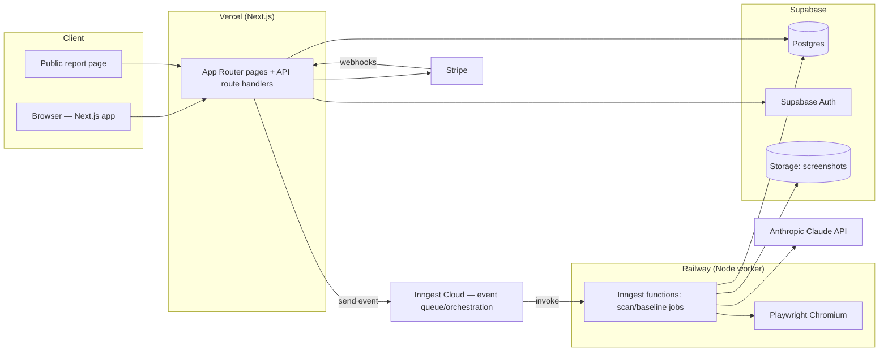

# PRD — SiteOps QA

> Technical blueprint for AI coding agents. Derived from the founder's source PRD
> (Google Doc) plus `docs/VISION.md` and `docs/product-vision.md`. Every section is
> written to be implementable without clarifying questions.

## 1. Overview

### Product Summary
**SiteOps QA** — SiteOps QA generates automated, client-ready WordPress QA receipts (PatchProof reports) after every update, edit, and launch. Users baseline the important pages of a WordPress site (desktop/mobile screenshots + technical snapshot), run scans after changes, and get visual diffs, technical checks, severity-classified issues, and AI-drafted internal and client-facing reports with shareable links.

### Objective
This PRD covers the MVP defined in `docs/product-vision.md` § Product Strategy: accounts/orgs/billing, add-site + page discovery, baselines, on-demand scans with visual + technical diffing, severity classification, AI report drafting, and the report builder with share links. Everything in § 13 Out of Scope is excluded.

### Market Differentiation
The implementation must deliver four things competitors don't combine: (1) WordPress-aware detection (wp-content/wp-json markers, sitemap conventions, form-plugin selectors); (2) severity classification tuned to agency priorities (a missing contact form is critical; a changed meta description is low); (3) evidence-grounded AI copy that never overclaims; (4) a client-shareable report that looks professional with zero design effort from the user. Scan reliability on messy real-world sites matters more than feature count.

### Magic Moment
An agency runs a scan after a plugin update and sees, within minutes, a before/after diff that catches real breakage — then sends the client a QA receipt proving the site was checked. Technical requirements: baseline and scan jobs must be reliable and show live progress; a 10-page scan should complete in under ~5 minutes; the results screen must lead with a verdict; report generation must be one click from results.

### Success Criteria
- A new user can go from signup to a completed baseline on a real WordPress site in < 15 minutes.
- A 10-page scan completes in < 5 minutes (p90) with per-page progress visible.
- Visual diff false-positive rate < 20% on the 50-example eval set (source PRD § 23).
- All P0 functional requirements implemented; scan worker failures degrade per-page, never crash a whole scan.
- Share links render reports publicly without auth, without leaking any other org data.

## 2. Technical Architecture

### Architecture Overview



### Chosen Stack

| Layer | Choice | Rationale |
|---|---|---|
| Frontend | Next.js (App Router) + Tailwind CSS | Source-PRD recommended; best agent support; Vercel deploy |
| Backend | Next.js route handlers + separate Node.js worker (Railway) | Scans need long-running Playwright sessions unsuited to serverless limits |
| Database | Supabase Postgres | PRD recommends Postgres; bundles auth + storage, minimal integration surface |
| Auth | Supabase Auth | Co-located with DB; simple email/password + magic link |
| Storage | Supabase Storage | Screenshots; signed URLs; same SDK as DB |
| Queue/Jobs | Inngest | Durable step functions, retries, concurrency limits; functions hosted on the worker |
| Browser automation | Playwright (Chromium) | PRD-specified |
| Payments | Stripe | PRD-specified; subscriptions + plan limits |
| AI | Anthropic Claude API (`claude-sonnet-5` default; `claude-haiku-4-5-20251001` for cheap classification assists) | Evidence-grounded summarization |
| Analytics | PostHog | Free tier; funnel events |
| Email | Resend | Auth emails (via Supabase SMTP) and future notifications |
| Error tracking | Sentry | App + worker; scan failures are messy |

### Stack Integration Guide
Setup order:
1. Create Supabase project → note `SUPABASE_URL`, `SUPABASE_ANON_KEY`, `SUPABASE_SERVICE_ROLE_KEY`, Postgres connection string.
2. Scaffold Next.js app (`create-next-app`, TypeScript, Tailwind, ESLint, `src/` dir, App Router). Add `@supabase/supabase-js` + `@supabase/ssr`.
3. Manage schema with SQL migrations in `supabase/migrations/` applied via Supabase CLI (`supabase db push`). Do not use an ORM; use typed query helpers via `supabase-js` and generated types (`supabase gen types typescript`).
4. Monorepo layout (npm workspaces): `apps/web` (Next.js) and `apps/worker` (Node + Inngest + Playwright), `packages/shared` (types, severity rules, zod schemas).
5. Inngest: `inngest` SDK in both apps. Web app *sends* events (`inngest.send()`); worker *serves* functions via `inngest/express` on Railway. One Inngest app id: `siteops-qa`.
6. Playwright in worker only: `npx playwright install --with-deps chromium` in the Railway build (use Playwright's official Docker base image `mcr.microsoft.com/playwright`).
7. Stripe: products/prices created by a seed script; webhooks to `/api/webhooks/stripe`.
8. Sentry: `@sentry/nextjs` in web, `@sentry/node` in worker.

Gotchas:
- Supabase RLS: enable on all tables; the worker uses the service-role key (bypasses RLS) — never ship the service key to the client.
- Playwright against real sites: set a realistic UA string plus `SiteOpsQA-Bot/1.0 (+https://siteopsqa.com/bot)` suffix, 30s nav timeout, `waitUntil: "networkidle"` with a 10s cap fallback, disable animations via `page.emulateMedia({ reducedMotion: "reduce" })` and inject CSS to pause animations before screenshots.
- Screenshot determinism: fixed viewports (desktop 1440×900, mobile 390×844 with mobile UA + `deviceScaleFactor: 2` off — use 1 to keep files small), scroll page fully to trigger lazy-load, then screenshot `fullPage: true`.
- Next.js + Supabase auth: use `@supabase/ssr` cookie-based sessions; middleware refreshes tokens.

Environment variables (web): `NEXT_PUBLIC_SUPABASE_URL`, `NEXT_PUBLIC_SUPABASE_ANON_KEY`, `SUPABASE_SERVICE_ROLE_KEY`, `INNGEST_EVENT_KEY`, `INNGEST_SIGNING_KEY`, `STRIPE_SECRET_KEY`, `STRIPE_WEBHOOK_SECRET`, `NEXT_PUBLIC_STRIPE_PUBLISHABLE_KEY`, `NEXT_PUBLIC_POSTHOG_KEY`, `SENTRY_DSN`, `NEXT_PUBLIC_APP_URL`.
Worker: `SUPABASE_URL`, `SUPABASE_SERVICE_ROLE_KEY`, `INNGEST_EVENT_KEY`, `INNGEST_SIGNING_KEY`, `ANTHROPIC_API_KEY`, `SENTRY_DSN`.

### Repository Structure

```
siteops/
├── apps/
│   ├── web/                        # Next.js app (Vercel)
│   │   ├── src/
│   │   │   ├── app/
│   │   │   │   ├── (marketing)/            # landing page
│   │   │   │   ├── (auth)/login, signup/
│   │   │   │   ├── (app)/dashboard, sites/[siteId]/, scans/[scanId]/, reports/[reportId]/, settings/, billing/
│   │   │   │   ├── r/[shareToken]/         # public report share page
│   │   │   │   └── api/                    # route handlers (REST) + webhooks
│   │   │   ├── components/ui/              # design-system primitives
│   │   │   ├── components/features/        # feature components
│   │   │   └── lib/                        # supabase clients, inngest client, stripe, posthog
│   │   └── ...
│   └── worker/                     # Node service (Railway)
│       ├── src/
│       │   ├── inngest/            # function definitions (baseline.create, scan.run)
│       │   ├── scan/               # capture.ts, checks/, diff/, classify.ts
│       │   ├── ai/                 # prompts + Claude client
│       │   └── index.ts            # express server serving /api/inngest
│       └── Dockerfile              # FROM mcr.microsoft.com/playwright
├── packages/shared/                # types, zod schemas, severity rules, plan limits
├── supabase/migrations/            # SQL migrations
└── docs/                           # this documentation
```

### Infrastructure & Deployment
- **Web:** Vercel, auto-deploy from `main`. Preview deploys per PR.
- **Worker:** Railway service from `apps/worker/Dockerfile`, auto-deploy from `main`. 2 GB RAM minimum (Chromium).
- **DB/Auth/Storage:** Supabase cloud (free tier to start; Pro at ~$25/mo when pilots onboard).
- **CI:** GitHub Actions — typecheck, lint, unit tests on PR.

### Security Considerations
- RLS on every table keyed by org membership (`org_id in (select org_id from organization_members where user_id = auth.uid())`).
- Route handlers verify session + org membership before any mutation; worker validates Inngest signing key.
- Share links: unguessable 32-char tokens (`crypto.randomBytes(24).toString('base64url')`), no enumeration, revocable, render only report content (no org/user data).
- SSRF guard on user-supplied URLs: resolve DNS and reject private/reserved IP ranges (10.x, 172.16–31.x, 192.168.x, 127.x, 169.254.x, ::1) before fetching; re-check on redirects; only http/https; block ports other than 80/443.
- Scans are read-only GETs: never submit forms, never POST to scanned sites, respect a 10-page/scan-session concurrency of 2 against a single origin to avoid hammering client sites.
- Input validation with zod at every API boundary; screenshot bucket is private, served via short-lived signed URLs (public report pages proxy through an endpoint that validates the share token).
- Sentry: enable `beforeSend` scrubbing; never capture request bodies on auth/billing routes; strip cookies/headers.
- Stripe webhook signature verification mandatory.

### Cost Estimate (first 6 months, < 1000 users)
| Service | Est. monthly | Notes |
|---|---|---|
| Vercel | $0–20 | Hobby → Pro |
| Railway worker | $10–30 | 2 GB container |
| Supabase | $0–25 | Pro when storage grows; screenshots dominate (budget ~1–2 MB/page/scan → retention policy) |
| Inngest | $0 | Free tier: 50k runs/mo |
| Anthropic API | $5–50 | ~2 Claude Sonnet calls per scan |
| Stripe | 2.9% + 30¢ | Per transaction |
| PostHog | $0 | 1M events/mo free |
| Resend | $0 | 3,000 emails/mo free |
| Sentry | $0 | Free error quota |
| **Total** | **~$15–150/mo** | |

## 3. Data Model

### Entity Definitions
SQL migrations in `supabase/migrations/`. All tables: `id UUID PRIMARY KEY DEFAULT gen_random_uuid()`, `created_at TIMESTAMPTZ NOT NULL DEFAULT now()`. Supabase Auth owns `auth.users`; app tables live in `public`.

```sql
CREATE TABLE profiles (              -- 1:1 with auth.users
  id UUID PRIMARY KEY REFERENCES auth.users(id) ON DELETE CASCADE,
  email TEXT NOT NULL,
  full_name TEXT,
  created_at TIMESTAMPTZ NOT NULL DEFAULT now()
);

CREATE TABLE organizations (
  id UUID PRIMARY KEY DEFAULT gen_random_uuid(),
  name TEXT NOT NULL,
  plan TEXT NOT NULL DEFAULT 'trial',           -- trial|freelancer|agency_starter|agency_pro|agency_scale
  billing_status TEXT NOT NULL DEFAULT 'trialing', -- trialing|active|past_due|canceled
  stripe_customer_id TEXT UNIQUE,
  stripe_subscription_id TEXT,
  trial_ends_at TIMESTAMPTZ NOT NULL DEFAULT now() + interval '14 days',
  created_at TIMESTAMPTZ NOT NULL DEFAULT now()
);

CREATE TABLE organization_members (
  org_id UUID NOT NULL REFERENCES organizations(id) ON DELETE CASCADE,
  user_id UUID NOT NULL REFERENCES profiles(id) ON DELETE CASCADE,
  role TEXT NOT NULL DEFAULT 'owner',           -- owner|member (MVP: owner only)
  PRIMARY KEY (org_id, user_id)
);

CREATE TABLE sites (
  id UUID PRIMARY KEY DEFAULT gen_random_uuid(),
  org_id UUID NOT NULL REFERENCES organizations(id) ON DELETE CASCADE,
  name TEXT NOT NULL,
  url TEXT NOT NULL,                            -- normalized origin, e.g. https://example.com
  wp_detection TEXT NOT NULL DEFAULT 'unknown', -- detected|not_detected|unknown
  wp_signals JSONB NOT NULL DEFAULT '{}',       -- {wpContent:bool, wpJson:bool, generator:string|null, ...}
  status TEXT NOT NULL DEFAULT 'active',        -- active|archived
  last_scan_at TIMESTAMPTZ,
  created_at TIMESTAMPTZ NOT NULL DEFAULT now()
);

CREATE TABLE monitored_pages (
  id UUID PRIMARY KEY DEFAULT gen_random_uuid(),
  site_id UUID NOT NULL REFERENCES sites(id) ON DELETE CASCADE,
  url TEXT NOT NULL,
  label TEXT,                                   -- "Homepage", "Contact"
  page_type TEXT NOT NULL DEFAULT 'other',      -- home|contact|landing|service|about|other
  importance TEXT NOT NULL DEFAULT 'normal',    -- critical|normal
  is_active BOOLEAN NOT NULL DEFAULT true,
  ignored_regions JSONB NOT NULL DEFAULT '[]',  -- [{x,y,width,height,viewport:"desktop"|"mobile"}]
  UNIQUE (site_id, url)
);

CREATE TABLE baselines (                        -- one row per page capture; latest active per page is "the baseline"
  id UUID PRIMARY KEY DEFAULT gen_random_uuid(),
  site_id UUID NOT NULL REFERENCES sites(id) ON DELETE CASCADE,
  page_id UUID NOT NULL REFERENCES monitored_pages(id) ON DELETE CASCADE,
  is_current BOOLEAN NOT NULL DEFAULT true,
  status TEXT NOT NULL DEFAULT 'pending',       -- pending|complete|failed
  desktop_screenshot_path TEXT,                 -- storage path
  mobile_screenshot_path TEXT,
  http_status INT,
  page_title TEXT, meta_description TEXT, h1 TEXT, canonical_url TEXT,
  html_hash TEXT,                               -- sha256 of normalized main-content HTML
  console_errors JSONB NOT NULL DEFAULT '[]',   -- [{type,text,url}]
  broken_links JSONB NOT NULL DEFAULT '[]',     -- [{href,status,text}]
  forms JSONB NOT NULL DEFAULT '[]',            -- [{selector,fieldCount,hasSubmit,plugin:"cf7"|"gravity"|"wpforms"|"ninja"|"hubspot"|"generic"}]
  ctas JSONB NOT NULL DEFAULT '[]',             -- [{selector,text,href}]
  wp_signals JSONB NOT NULL DEFAULT '{}',       -- page builder detection etc.
  error_message TEXT,
  created_at TIMESTAMPTZ NOT NULL DEFAULT now()
);

CREATE TABLE scans (
  id UUID PRIMARY KEY DEFAULT gen_random_uuid(),
  site_id UUID NOT NULL REFERENCES sites(id) ON DELETE CASCADE,
  trigger_type TEXT NOT NULL DEFAULT 'manual',  -- manual|baseline (baseline runs reuse the pipeline)
  status TEXT NOT NULL DEFAULT 'queued',        -- queued|running|complete|failed
  user_note TEXT,                               -- "updated 6 plugins"
  pages_total INT NOT NULL DEFAULT 0,
  pages_done INT NOT NULL DEFAULT 0,
  overall_severity TEXT,                        -- worst issue severity: critical|high|medium|low|info|pass
  ai_internal_summary TEXT,
  ai_client_summary TEXT,
  started_at TIMESTAMPTZ, completed_at TIMESTAMPTZ,
  created_by UUID REFERENCES profiles(id),
  created_at TIMESTAMPTZ NOT NULL DEFAULT now()
);

CREATE TABLE page_scan_results (
  id UUID PRIMARY KEY DEFAULT gen_random_uuid(),
  scan_id UUID NOT NULL REFERENCES scans(id) ON DELETE CASCADE,
  page_id UUID NOT NULL REFERENCES monitored_pages(id) ON DELETE CASCADE,
  baseline_id UUID REFERENCES baselines(id),    -- baseline compared against
  status TEXT NOT NULL DEFAULT 'pending',       -- pending|complete|failed
  http_status INT,
  desktop_screenshot_path TEXT, mobile_screenshot_path TEXT,
  desktop_diff_path TEXT, mobile_diff_path TEXT, -- generated diff overlay images
  desktop_diff_ratio REAL, mobile_diff_ratio REAL, -- 0..1 changed-pixel ratio after noise filter
  metadata_snapshot JSONB NOT NULL DEFAULT '{}',   -- same shape as baseline fields
  console_errors JSONB NOT NULL DEFAULT '[]',
  broken_links JSONB NOT NULL DEFAULT '[]',
  forms JSONB NOT NULL DEFAULT '[]',
  ctas JSONB NOT NULL DEFAULT '[]',
  severity TEXT,                                -- worst issue on this page
  error_message TEXT,
  created_at TIMESTAMPTZ NOT NULL DEFAULT now()
);

CREATE TABLE issues (
  id UUID PRIMARY KEY DEFAULT gen_random_uuid(),
  scan_id UUID NOT NULL REFERENCES scans(id) ON DELETE CASCADE,
  page_id UUID REFERENCES monitored_pages(id) ON DELETE SET NULL,
  type TEXT NOT NULL,          -- see § Issue Types
  severity TEXT NOT NULL,      -- critical|high|medium|low|info
  needs_review BOOLEAN NOT NULL DEFAULT false,
  title TEXT NOT NULL,
  description TEXT NOT NULL,
  evidence JSONB NOT NULL DEFAULT '{}',  -- type-specific: {before,after}, {link,status}, {errorText}, diff paths
  recommendation TEXT,
  status TEXT NOT NULL DEFAULT 'open',   -- open|expected|resolved|dismissed
  human_notes TEXT,
  created_at TIMESTAMPTZ NOT NULL DEFAULT now()
);

CREATE TABLE reports (
  id UUID PRIMARY KEY DEFAULT gen_random_uuid(),
  scan_id UUID NOT NULL REFERENCES scans(id) ON DELETE CASCADE,
  org_id UUID NOT NULL REFERENCES organizations(id) ON DELETE CASCADE,
  type TEXT NOT NULL,                    -- internal|client
  title TEXT NOT NULL,
  content JSONB NOT NULL,                -- ordered sections: [{id,heading,body,visible}]
  agency_notes TEXT,
  next_steps TEXT,
  share_token TEXT UNIQUE,               -- null until shared; base64url(24 bytes)
  share_enabled BOOLEAN NOT NULL DEFAULT false,
  created_by UUID REFERENCES profiles(id),
  created_at TIMESTAMPTZ NOT NULL DEFAULT now(),
  updated_at TIMESTAMPTZ NOT NULL DEFAULT now()
);
```

**Issue Types** (`issues.type` enum values, enforced in `packages/shared/src/issues.ts`): `http_status_change`, `page_404`, `page_5xx`, `visual_change_desktop`, `visual_change_mobile`, `form_missing`, `form_changed`, `cta_missing`, `broken_link`, `missing_image`, `console_error`, `title_changed`, `title_missing`, `h1_changed`, `h1_missing`, `meta_description_changed`, `meta_description_missing`, `canonical_changed`, `scan_page_failed`.

### Relationships
- `organizations` 1:many `sites`, `reports`; many:many `profiles` via `organization_members` (cascade delete members, keep profiles).
- `sites` 1:many `monitored_pages`, `baselines`, `scans` (cascade).
- `monitored_pages` 1:many `baselines`, `page_scan_results` — exactly one `baselines` row per page with `is_current = true` (partial unique index).
- `scans` 1:many `page_scan_results`, `issues`, `reports` (cascade).

### Indexes
```sql
CREATE UNIQUE INDEX one_current_baseline ON baselines (page_id) WHERE is_current;
CREATE INDEX idx_sites_org ON sites (org_id);
CREATE INDEX idx_pages_site ON monitored_pages (site_id) WHERE is_active;
CREATE INDEX idx_scans_site_created ON scans (site_id, created_at DESC);   -- scan history lists
CREATE INDEX idx_results_scan ON page_scan_results (scan_id);
CREATE INDEX idx_issues_scan_severity ON issues (scan_id, severity);
CREATE INDEX idx_reports_share ON reports (share_token) WHERE share_enabled;
```

## 4. API Specification

### API Design Philosophy
REST via Next.js route handlers under `/api`. Auth: Supabase session cookie (via `@supabase/ssr`); every handler resolves `user` and verifies org membership for the resource. Errors: `{ error: string, details?: object }` with proper status codes. Pagination: `?cursor=<created_at>&limit=20` where lists can grow. All request bodies validated with zod schemas from `packages/shared`. Server components read directly via Supabase queries; the REST layer exists for mutations, webhooks, polling, and the public report endpoint.

### Endpoints

```
POST /api/orgs                          Auth: required
  Body: { name: string }
  201: { id, name, plan: "trial" }      Creates org + owner membership. One org per user in MVP.

POST /api/sites                         Auth: required (org owner)
  Body: { url: string, name?: string }
  201: { id, url, name, wpDetection, wpSignals }
  Behavior: normalize URL to origin; SSRF check; fetch homepage; detect WP markers
  (/wp-content/ in HTML, /wp-json/ reachable, generator meta). wpDetection:
  "not_detected" is a warning, not a block.
  400: invalid/unreachable URL | 402: plan site limit reached

GET  /api/sites                         Auth: required → 200: site list w/ last scan + severity
GET  /api/sites/:id                     Auth: required → 200: site + pages + current baseline status
PATCH /api/sites/:id                    Body: { name?, status? } → 200
DELETE /api/sites/:id                   → 204 (cascades)

POST /api/sites/:id/discover-pages      Auth: required
  202: { discovered: [{url, title?, source: "sitemap"|"manual"}] }
  Behavior: try /sitemap.xml, /sitemap_index.xml, /wp-sitemap.xml, Yoast
  (/sitemap_index.xml), fetch up to 500 URLs, dedupe, same-origin only. Synchronous
  (<15s) — returns list, does not persist.

PUT  /api/sites/:id/pages               Auth: required
  Body: { pages: [{url, label?, pageType?, importance?}] }   (replaces active set)
  200: { pages: [...] }
  402: plan page limit exceeded

POST /api/sites/:id/baseline            Auth: required
  202: { scanId }                       Sends inngest event "baseline.requested".
                                        Baselines run through the scan pipeline with
                                        trigger_type="baseline" (capture only, no compare).

POST /api/sites/:id/scans               Auth: required
  Body: { note?: string }
  202: { scanId }                       Sends "scan.requested". 409 if a scan for this
                                        site is already queued/running. 412 if no
                                        current baseline exists.

GET  /api/scans/:id                     Auth: required
  200: { id, status, pagesTotal, pagesDone, overallSeverity, startedAt, completedAt,
         results: [{pageId, status, severity, diffRatios, screenshotUrls (signed)}],
         issues: [...] }                Client polls this every 2s while running.

GET  /api/sites/:id/scans               Auth: required → 200: paginated scan history

PATCH /api/issues/:id                   Auth: required
  Body: { status?: "expected"|"resolved"|"dismissed", humanNotes?: string }
  200: updated issue. Marking "expected" is the diff-noise feedback loop.

POST /api/scans/:id/reports             Auth: required
  Body: { type: "internal"|"client" }
  201: { id, title, content }           Generates report from scan data + AI summaries
                                        (AI already drafted during scan; builder just
                                        assembles sections).

GET  /api/reports/:id                   Auth: required → 200: full report
PATCH /api/reports/:id                  Body: { title?, content?, agencyNotes?, nextSteps? } → 200
POST /api/reports/:id/share             → 200: { shareUrl }  (generates token, share_enabled=true)
DELETE /api/reports/:id/share           → 204 (revokes)

GET  /api/public/reports/:shareToken    Auth: none
  200: { title, content (visible sections only), createdAt, screenshots via
        short-lived signed URLs }       404 if token invalid or sharing disabled.

POST /api/billing/checkout              Auth: required
  Body: { plan: "freelancer"|"agency_starter"|"agency_pro"|"agency_scale" }
  200: { checkoutUrl }                  Stripe Checkout session (subscription mode).
POST /api/billing/portal                → 200: { portalUrl }
POST /api/webhooks/stripe               Auth: Stripe signature
  Handles: checkout.session.completed, customer.subscription.updated/deleted,
  invoice.payment_failed → update organizations.plan/billing_status.

POST /api/webhooks/inngest              (served by worker, not web — listed for completeness)
```

## 5. User Stories

### Epic: Onboarding & Site Setup
**US-001: Add a WordPress site**
As Marcus (agency owner), I want to add a client site by URL and have the system confirm it's WordPress so that I trust the tool understands my stack.
- [ ] Given a valid WP site URL, when I submit it, then the site is created and shows "WordPress detected" with the signals found.
- [ ] Given a non-WP site, when I submit it, then I see a non-blocking warning and can proceed.
- [ ] Edge: unreachable URL → inline error "We couldn't reach this site," site not created.
- [ ] Edge: private IP / localhost URL → rejected with validation error.

**US-002: Discover and select pages**
As Marcus, I want the system to find my site's pages so that I can pick the important ones without typing URLs.
- [ ] Given a site with a sitemap, when discovery runs, then pages are listed with checkboxes within 15s.
- [ ] Given no sitemap, when discovery fails, then I can add URLs manually.
- [ ] Given plan limit of N pages, when I select N+1, then selection is blocked with an upgrade prompt.

**US-003: Create a baseline**
As Marcus, I want a baseline of my selected pages so that future scans have something to compare against.
- [ ] Given selected pages, when I click "Create baseline," then per-page progress shows and thumbnails appear as pages complete.
- [ ] Given one page fails, when the baseline finishes, then that page is marked failed with a retry option and the rest are complete.

### Epic: Scanning & Results
**US-004: Run a post-update scan**
As Marcus, I want to run a scan right after updating plugins so that I know immediately if anything important broke.
- [ ] Given a baselined site, when I click "Run scan" and add a note, then a scan starts with live per-page progress.
- [ ] Given the scan completes, then I see a verdict (pass / needs review / issues found), issue counts by severity, and per-page results.
- [ ] Edge: a monitored page now returns 500 → scan completes, page flagged critical, escalated to "needs review."

**US-005: Review visual diffs**
As Dana (freelancer), I want side-by-side before/after screenshots with changes highlighted so that I can judge a change in seconds.
- [ ] Given a visual change, when I open the page result, then I see baseline vs current screenshots and a diff overlay for desktop and mobile.
- [ ] Given the change was intentional, when I mark the issue "expected," then it's excluded from report issue counts.

**US-006: Trust the severity labels**
As Marcus, I want a missing contact form to scream and a changed meta description to whisper so that I can triage instantly.
- [ ] Given a form present in baseline but missing in scan, then a critical issue "Contact form no longer detected" is created and flagged needs-review.
- [ ] Given a meta description change, then a low-severity issue is created, not escalated.

### Epic: Reports
**US-007: Generate a client receipt**
As Marcus, I want a plain-English client report drafted for me so that sending proof takes minutes.
- [ ] Given a completed scan, when I generate a client report, then it contains summary, pages checked, results, notes, and next steps — in calm plain English.
- [ ] Given AI drafted the copy, when I edit any section, then my edits persist.
- [ ] Given technical details exist, when the report type is "client," then console errors/technical evidence are hidden by default.

**US-008: Share a report**
As Dana, I want a shareable link so that my client can view the receipt without an account.
- [ ] Given a report, when I click Share, then I get a public URL that renders it without auth.
- [ ] Given I revoke sharing, then the URL returns 404.
- [ ] Edge: share URL never exposes other pages, orgs, or scan internals.

### Epic: Billing
**US-009: Subscribe and hit limits**
As Marcus, I want to subscribe to a plan sized to my site count so that pricing matches my agency.
- [ ] Given a trial org, when I complete Stripe Checkout for Agency Starter, then my plan updates and limits raise to 25 sites / 50 pages per site.
- [ ] Given the trial expires without subscribing, then scans are blocked (data preserved) with an upgrade prompt.
- [ ] Given payment fails, then billing_status becomes past_due and a banner shows; access continues for 7 days.

## 6. Functional Requirements

### Accounts & Organizations
**FR-001: Email auth** — P0 — Supabase Auth email/password + magic link; profile row auto-created via trigger on `auth.users` insert. AC: signup, login, logout, password reset all work. Stories: US-001.
**FR-002: Organization creation** — P0 — First-login flow creates an org; user becomes owner. One org per user in MVP. AC: no app screen is reachable without an org. Stories: US-001.

### Site Management
**FR-003: Add site with URL normalization + WP detection** — P0 — Normalize to origin (strip paths/query, force https where available, follow redirects ≤3). Detect WordPress via: `/wp-content/` substring in homepage HTML, `GET /wp-json/` returns JSON, `<meta name="generator" content="WordPress...">`. Store signals. AC: per US-001. SSRF guard per § 2 Security.
**FR-004: Page discovery via sitemap** — P0 — Try `/sitemap.xml`, `/sitemap_index.xml`, `/wp-sitemap.xml` (parse sitemap indexes one level deep), cap 500 URLs, same-origin, dedupe trailing slashes. Manual URL entry always available (validated same-origin). AC: per US-002.
**FR-005: Monitored page selection with plan limits** — P0 — Select/deselect, label, set page_type and importance. Enforce per-plan page limits server-side. AC: per US-002.

### Baseline & Scan Engine (worker)
**FR-006: Page capture pipeline** — P0 — For each page, in one Playwright context per viewport: navigate (30s timeout), settle (networkidle capped 10s), scroll-through for lazy-load, capture: full-page screenshot (desktop 1440×900, mobile 390×844 + mobile UA), HTTP status of main document, title/meta description/H1(first)/canonical, normalized-HTML sha256 (strip nonces, timestamps, csrf tokens, style/script contents before hashing), console errors (`page.on('console')` type=error + `pageerror`), failed requests (`requestfailed` + responses ≥400) → missing images and network errors, same-origin `<a href>` link check (HEAD, fallback GET, concurrency 5, cap 100 links/page, external links checked but labeled), form detection (see FR-007), CTA detection (heuristic: `<a>`/`<button>` matching /contact|quote|book|call|buy|get started|sign up|subscribe|download/i in header/hero/footer, store top 5). AC: baseline row fully populated for a healthy page; per-field null tolerance for failures.
**FR-007: Conservative form detection** — P0 — Detect `<form>` elements plus plugin containers: CF7 (`.wpcf7`), Gravity (`.gform_wrapper`), WPForms (`.wpforms-container`), Ninja (`.nf-form-cont`), HubSpot (`.hbspt-form`, `iframe[src*="hsforms"]`). Record field count, visible submit control, plugin guess. **Never submit forms.** AC: per US-006.
**FR-008: Baseline creation job** — P0 — Inngest function `baseline.create`: iterates active pages (concurrency 2/origin), writes `baselines` rows, marks previous `is_current=false` per page, updates progress counters, per-page failure isolation. AC: per US-003.
**FR-009: On-demand scan job** — P0 — Inngest function `scan.run`: same capture per page → `page_scan_results`; then comparison steps (FR-010/011/012) → `issues`; then AI summaries (FR-014); set `overall_severity` = worst open issue severity or "pass". Progress via `pages_done`. One concurrent scan per site (Inngest concurrency key = site_id). AC: per US-004; 10 pages < 5 min p90.
**FR-010: Visual diff** — P0 — Compare screenshots per viewport with pixelmatch on sharp-normalized PNGs (equalize dimensions by padding to max height; threshold 0.1; `includeAA: false`). Apply ignored_regions (zero out). Compute diff ratio = changed px / total px, generate red-overlay diff image, store. Thresholds: ratio < 0.5% → no issue; 0.5–3% → low `visual_change_*`; 3–10% → medium; > 10% → high + needs_review; > 25% or diff concentrated in top 30% of page (above-the-fold) → critical + needs_review. AC: per US-005; noise controls per § 11.
**FR-011: Technical comparison** — P0 — Diff scan vs baseline: HTTP status change (2xx→4xx/5xx = critical `page_404`/`page_5xx`; other changes = high); title/H1/meta/canonical changed (medium) or missing-now (title/H1 high, meta medium); new console errors (medium; high if > 3 new or contains "Uncaught"); new broken internal links (medium; low for external); missing images (medium). Only *new* problems create issues — pre-existing baseline problems are informational. AC: per US-004/006.
**FR-012: Form/CTA regression detection** — P0 — Form present in baseline, absent in scan → critical `form_missing` + needs_review. Field count dropped or submit missing → high `form_changed`. CTA from baseline top-5 missing → high `cta_missing` (medium if importance=normal page). AC: per US-006.
**FR-013: Severity classification & escalation** — P0 — Severity assigned by deterministic rule table in `packages/shared/src/severity.ts` (single source of truth used by worker + UI). `needs_review=true` when: any critical; visual > 10%; form/CTA missing; page failed to scan; 5xx/404/403 on monitored page. AC: rule table has unit tests covering the § 23 eval scenarios subset.
**FR-014: AI scan summaries** — P0 — Two Claude calls per scan (`claude-sonnet-5`): internal summary and client summary. Input: structured JSON of scan results + issues (no raw HTML). System prompt enforces: only reference provided evidence; uncertainty language ("likely", "may"); never claim fixes; client version is calm plain English, no jargon; internal version includes likely causes labeled as hypotheses and recommended next steps. Output stored on `scans`. Failure tolerance: scan completes even if AI call fails (summaries null, retry button). AC: per US-007; prompt snapshot tests.

### Results & Reports (web)
**FR-015: Scan results UI** — P0 — Verdict banner (pass / needs review / issues found by overall_severity), severity counts, per-page cards with thumbnail + severity, page detail with side-by-side + diff overlay (desktop/mobile tabs), issue list with evidence, mark expected/resolved/dismissed. AC: per US-004/005.
**FR-016: Report builder** — P0 — Generate internal or client report from scan: assembles sections (summary [AI], pages checked, results, issues [severity-filtered], agency notes, next steps, timestamp). Editable sections (textarea-based, markdown-lite), visibility toggles per section, client type hides technical evidence by default. AC: per US-007.
**FR-017: Shareable report links** — P0 — Token generation/revocation per § 4; public page renders visible sections + screenshots via signed URLs; no auth, no org data, `noindex` meta. AC: per US-008.
**FR-018: Scan history** — P1 — Per-site list of scans with date, note, verdict, issue counts; links to results and reports. AC: history paginates; per US-004.
**FR-019: Re-baseline** — P1 — "Set as new baseline" action on a completed scan copies its captures into new current baselines (per page, only pages that succeeded). AC: subsequent scans compare against the new baseline.
**FR-020: Dashboard** — P1 — Org dashboard listing sites with: last scan verdict/date, open critical/high counts, "not scanned in 30+ days" flag, quick actions (scan, view report). No charts in MVP. AC: answers "which sites need attention" per source PRD § 13.3.

### Billing
**FR-021: Stripe subscriptions** — P0 — Checkout + customer portal + webhooks per § 4 and § 10. Plans/limits in `packages/shared/src/plans.ts`: trial (1 site / 5 pages / manual scans), freelancer $59 (5 / 25), agency_starter $199 (25 / 50), agency_pro $399 (75 / 100), agency_scale $699 (150 / 100+). AC: per US-009.
**FR-022: Plan limit enforcement** — P0 — Server-side checks on: add site, save pages, run scan (trial expiry blocks scans). Friendly 402 responses with upgrade CTA. AC: per US-002/009.

### Instrumentation
**FR-023: Analytics events** — P1 — PostHog: `signup`, `org_created`, `site_added`, `pages_selected`, `baseline_completed`, `scan_started`, `scan_completed` (with severity + duration), `issue_marked_expected`, `report_generated`, `report_shared` (magic-moment funnel), `checkout_started`, `subscription_activated`. AC: funnel visible in PostHog.

## 7. Non-Functional Requirements

### Performance
- App page loads: LCP < 2.5s on Fast 3G for dashboard and results (screenshots lazy-loaded, thumbnails ≤ 200 KB WebP).
- API p95 < 300ms excluding scan endpoints (which are async).
- Scan throughput: 10-page scan < 5 min p90; worker handles 3 concurrent scans (Inngest concurrency = 3 global, 1 per site).
- Screenshot storage: full-page PNG → WebP thumbnails generated at capture; retention: keep full images for last 10 scans per site + all baselines, thumbnails forever (enforced by weekly cleanup job).

### Security
- OWASP Top 10 addressed; RLS on all tables; SSRF guard per § 2; rate limits: auth 10/min/IP, scan trigger 10/hour/org, public report 60/min/IP (middleware, upstash-style in-memory acceptable for MVP on single region).
- Supabase session tokens: default 1h access / rotating refresh.
- No secrets in client bundle; service-role key server/worker only.

### Accessibility
- WCAG 2.1 AA for the app and the public report page (the client-facing artifact must be accessible): keyboard navigable, focus states, alt text on screenshots ("Baseline screenshot of /contact, desktop"), color-independent severity (icon + label, never color alone).

### Scalability
- MVP targets ≤ 100 orgs, ≤ 2,000 sites, ≤ 50k stored screenshots. Postgres and one 2 GB worker suffice; scale path = more worker replicas (Inngest fans out) + Supabase Pro.

### Reliability
- 99.5% app uptime target; scans degrade per-page (a failed page is a `scan_page_failed` issue, never a failed scan unless *all* pages fail).
- Inngest retries: capture steps 2 retries with backoff; AI steps 1 retry then null.
- Third-party outage behavior: Anthropic down → scans complete without summaries; Stripe down → billing pages show retry message; Supabase Storage errors → page marked failed with retry.

## 8. UI/UX Requirements

> Visual tokens are defined in `docs/design.md` (generated 2026-07-02 from the NeoPay dashboard reference + billow.so inspiration; human-readable mirror at `docs/design.html`). Component names below (`button-primary`, `card`, `badge-severity-*`, `banner-verdict-*`, `report-document`, etc.) map to its `components:` block. Layout shell: top nav (org switcher-less in MVP: logo, Dashboard, Billing, account menu) + content area; site pages use a sub-nav (Overview, Pages, Scans, Reports).

### Screen: Login / Signup
Route: `/login`, `/signup` — Purpose: auth. Layout: centered card, logo, email/password + magic-link option.
States — Empty: form. Loading: button spinner. Error: inline field + toast for auth failures ("That email or password didn't match."). Populated: n/a.
Interactions: submit → redirect to `/dashboard` (or org-creation step on first login).
Components: `input-text`, `button-primary`, `card`.

### Screen: Create Organization (first-run)
Route: `/onboarding/org` — Purpose: name the workspace. One field, one button; creates org and routes to `/sites/new`.

### Screen: Dashboard
Route: `/dashboard` — Purpose: "which sites need attention?" Layout: page header with "Add site" button; site cards/table rows: name, URL, last-scan verdict badge, open critical/high count, last scan date, stale flag (30+ days), row actions (Run scan, View).
States — Empty: illustration + "Add your first site and we'll find its pages for you." + `button-primary`. Loading: skeleton rows. Error: retry banner. Populated: rows sorted by severity desc, then staleness.
Interactions: Run scan → confirm modal with note field → toast + row shows running state (poll).
Components: `card`, `badge-severity`, `button-primary`, `table`.

### Screen: Add Site
Route: `/sites/new` — Purpose: URL entry + WP detection. Layout: single card, URL input, on submit shows detection results (checkmarks for wp-content/wp-json/generator) then "Continue to pages."
States — Error: unreachable URL inline error; non-WP warning banner (proceed allowed). Loading: "Checking your site…" progress line.
Components: `input-text`, `button-primary`, `alert-warning`.

### Screen: Page Discovery & Selection
Route: `/sites/[siteId]/pages` — Purpose: select monitored pages. Layout: two-panel — discovered pages list (checkbox, URL, editable label, page-type select, importance toggle) + selected-count sidebar showing plan limit ("8 of 25 pages"). Manual "Add URL" input at top.
States — Empty (no sitemap): info banner "No sitemap found — add URLs manually." Loading: "Reading your sitemap…" spinner. Error: discovery failed banner + manual entry still works. Populated: list, homepage pre-selected.
Interactions: Save selection → PUT pages → CTA "Create baseline" appears.
Components: `checkbox`, `input-text`, `select`, `badge`, `button-primary`.

### Screen: Baseline Progress / Site Overview
Route: `/sites/[siteId]` — Purpose: site home. Layout: header (site name, URL, WP badge, "Run scan" primary button — disabled until baseline complete), baseline status card (per-page rows: thumbnail placeholder → thumbnail, status icon, retry on failed), recent scans list.
States — Empty: "No baseline yet" + Create baseline CTA. Loading/running: per-page progress with live updates (poll 2s). Error: failed pages listed with retry-all. Populated: baseline summary + scan history preview.
Components: `card`, `progress`, `badge-severity`, `button-primary`, `thumbnail`.

### Screen: Scan Progress & Results
Route: `/scans/[scanId]` — Purpose: the magic-moment screen. Layout: verdict banner (pass=green "No issues found", review=amber "Needs review", fail=red "Issues found") + severity count chips; user note; page result cards grid (thumbnail, page label, severity badge, diff-ratio hint); "Generate report" primary button (enabled when complete).
States — Loading/running: banner shows "Scanning… 4 of 8 pages", completed cards fill in live. Empty: n/a (always has pages). Error: scan failed banner + "Retry scan". Populated: verdict + cards.
Interactions: click page card → page detail; Generate report → modal choose internal/client → creates + routes to builder.
Components: `banner`, `badge-severity`, `card`, `button-primary`, `chip`.

### Screen: Page Result Detail
Route: `/scans/[scanId]/pages/[pageId]` — Purpose: judge one page's changes. Layout: viewport tabs (Desktop/Mobile); three-way image strip: baseline | current | diff overlay (click to zoom/lightbox); below: issue list for this page (severity badge, title, evidence snippet, actions: Mark expected / Resolved / Dismiss / Add note); collapsible technical panel (console errors, broken links, metadata table with before/after columns, form detection results).
States — Loading: image skeletons. Error: page failed to scan → show error message + baseline images + retry. Populated: full comparison.
Components: `tabs`, `image-compare`, `badge-severity`, `accordion`, `button-secondary`.

### Screen: Issue Detail (inline expansion, not separate route)
Issues expand in place showing full evidence (before/after values, error text, link lists) + human notes textarea + status buttons.

### Screen: Report Builder
Route: `/reports/[reportId]` — Purpose: review/edit before sharing. Layout: left = editable sections (heading + textarea per section, visibility eye-toggle per section, drag-free fixed order); right = live preview styled as the public page. Header: report type badge, title input, Save, Share button.
States — Loading: skeleton. Error: save conflict toast (last-write-wins acceptable in MVP). Populated: AI-drafted content pre-filled.
Interactions: Share → modal with generated URL + copy button + revoke; client-type report shows "Technical details hidden" indicator on hidden sections.
Components: `textarea`, `toggle`, `button-primary`, `modal`, `preview-pane`.

### Screen: Public Report (Client Receipt)
Route: `/r/[shareToken]` — Purpose: the client-facing artifact. Layout: clean document — title, date, summary, pages-checked list with checkmarks, results summary (counts in plain English), flagged changes with small before/after thumbnails (only if section visible), agency notes, next steps, footer "QA by SiteOps QA" (subtle). No app chrome, no login, print-friendly CSS, `noindex`.
States — Error: 404 page for invalid/revoked tokens. Populated: document view.
Components: `report-document` (dedicated, from design.md).

### Screen: Billing
Route: `/billing` — Purpose: plan selection + management. Layout: current plan card (limits + usage: "3 of 5 sites"), plan grid with feature bullets and Choose buttons → Stripe Checkout; "Manage billing" → Stripe portal. Trial banner with days remaining app-wide when trialing.
States — past_due: red banner "Payment failed — update your card" → portal.
Components: `card`, `button-primary`, `banner`.

### Screen: Account Settings
Route: `/settings` — Purpose: profile (name), org name, sign out, danger zone (delete org — typed confirmation).

## 9. Auth Implementation

### Auth Flow
Supabase Auth, email/password + magic link. Client uses `@supabase/ssr` browser client; server components/route handlers use the server client bound to cookies. Middleware (`src/middleware.ts`) refreshes sessions and gates `(app)` routes.

### Provider Configuration
1. Supabase dashboard → Auth: enable Email provider, set Site URL to `NEXT_PUBLIC_APP_URL`, add redirect URLs (`/auth/callback`).
2. Configure custom SMTP with Resend (`smtp.resend.com`) so auth emails come from the product domain.
3. DB trigger: `on auth.users insert → insert into public.profiles (id, email)`.

```ts
// src/lib/supabase/server.ts
import { createServerClient } from "@supabase/ssr";
import { cookies } from "next/headers";
export async function createClient() {
  const cookieStore = await cookies();
  return createServerClient(process.env.NEXT_PUBLIC_SUPABASE_URL!, process.env.NEXT_PUBLIC_SUPABASE_ANON_KEY!, {
    cookies: { getAll: () => cookieStore.getAll(), setAll: (c) => c.forEach(({ name, value, options }) => cookieStore.set(name, value, options)) },
  });
}
```

### Protected Routes
All routes in `(app)` group: middleware redirects unauthenticated → `/login`; layout server-component loads profile + org, redirects to `/onboarding/org` if no org membership. `/r/[shareToken]` and `(marketing)` are public.

### User Session Management
Cookie-based; `supabase.auth.getUser()` in server contexts (never trust `getSession()` alone server-side). Logout via `supabase.auth.signOut()` + redirect.

### Role-Based Access
MVP: single role `owner`. All org-scoped queries filter by membership (RLS enforces even if app code forgets). The `role` column exists for future team features; do not build role UI now.

## 10. Payment Integration

### Payment Flow
Trial (14 days, no card) → Stripe Checkout (subscription) → webhook updates org → plan limits apply immediately. Upgrades/downgrades and cancellation through Stripe Customer Portal.

### Provider Setup
- Products/prices via seed script `scripts/stripe-seed.ts` (idempotent, uses `lookup_key`s: `freelancer_monthly` $59, `agency_starter_monthly` $199, `agency_pro_monthly` $399, `agency_scale_monthly` $699).
- Store mapping lookup_key → plan in `packages/shared/src/plans.ts`.
- Checkout session: `mode: "subscription"`, `client_reference_id: orgId`, `customer_email` prefilled, success `/billing?success=1`, cancel `/billing`.

### Pricing Model Implementation
`plans.ts` exports `PLAN_LIMITS: Record<Plan, { sites: number; pagesPerSite: number; scheduledScans: boolean }>` — trial `{1, 5, false}`, freelancer `{5, 25, false}` (scheduled scans are post-MVP even where plan includes them; flag exists for later), agency_starter `{25, 50, ...}`, agency_pro `{75, 100, ...}`, agency_scale `{150, 100, ...}`. Enforcement helper `assertWithinLimits(orgId, action)` used by site/page/scan endpoints.

### Webhook Handling
`/api/webhooks/stripe` (Node runtime, raw body): verify signature; `checkout.session.completed` → set `stripe_customer_id`, `stripe_subscription_id`, plan from price lookup_key, `billing_status='active'`; `customer.subscription.updated` → sync plan + status (`past_due`, `canceled`); `invoice.payment_failed` → `past_due`. Idempotent by event id (store processed ids in a `stripe_events` table).

### Subscription Management
Gating: middleware-level check is *not* used; enforcement lives in the three mutation points (add site, save pages, run scan) + a `useOrgPlan()` hook for UI states. Trial expiry: `trial_ends_at < now()` and no subscription → block scan trigger with 402. Test with Stripe test clocks + `stripe listen` locally.

## 11. Edge Cases & Error Handling

### Feature: Site Addition & Discovery
| Scenario | Expected Behavior | Priority |
|---|---|---|
| URL unreachable / DNS failure | Inline error, site not created | P0 |
| URL resolves to private IP (SSRF) | 400 validation error, logged | P0 |
| Redirect chain > 3 or cross-origin redirect | Use final origin if public; reject if private | P0 |
| Site behind Cloudflare bot challenge | Detection may fail → warning "We had trouble reading this site"; allow manual pages; scans may capture challenge page — flag as `scan_page_failed` with hint | P1 |
| No sitemap found | Banner + manual entry path | P0 |
| Sitemap > 500 URLs | Truncate with notice "Showing first 500" | P1 |
| Non-WordPress site added | Warning badge, all features still work | P0 |

### Feature: Baseline & Scans
| Scenario | Expected Behavior | Priority |
|---|---|---|
| Page times out during capture | Retry ×2 (Inngest), then mark page failed, others proceed | P0 |
| Page newly returns 404/500 during scan | Capture what's possible; critical issue; needs_review | P0 |
| All pages fail | Scan status `failed`, Sentry alert, user sees retry | P0 |
| Screenshots differ in height | Pad shorter image before diff; height delta > 20% adds a layout-change signal | P0 |
| Cookie banner/popup appears in one capture | Expected noise: attempt auto-dismiss of common consent selectors before screenshot; residual diffs mitigated by ignored regions + mark-expected | P1 |
| Scan triggered while another runs on same site | 409 with "A scan is already running" | P0 |
| Baseline missing when scan requested | 412 → UI routes to baseline creation | P0 |
| Worker crash mid-scan | Inngest resumes/retries step; scan never stuck > 30 min (watchdog step marks failed) | P0 |
| Anthropic API failure | Scan completes, summaries null, "Draft with AI" retry button in report builder | P0 |
| Storage upload failure | Page marked failed with retry; no orphaned DB rows (write row only after upload) | P1 |

### Feature: Reports & Sharing
| Scenario | Expected Behavior | Priority |
|---|---|---|
| Invalid/revoked share token | Generic 404, no information leak | P0 |
| Report generated from scan with zero issues | Positive receipt ("all checks passed") — this is a key selling artifact, make it good | P0 |
| Signed screenshot URL expires while client reads report | URLs minted per-request server-side on the public page (never cached long) | P0 |
| Concurrent edits to a report | Last-write-wins, `updated_at` check optional toast | P2 |

### Feature: Auth & Billing
| Scenario | Expected Behavior | Priority |
|---|---|---|
| Session expires mid-action | 401 → redirect to login, return path preserved | P0 |
| Webhook received before checkout redirect | Idempotent handlers; UI polls org plan on `/billing?success=1` | P0 |
| Payment fails after months active | `past_due` banner, 7-day grace, then scans blocked (data kept) | P1 |
| User deletes org | Typed confirmation; cascade deletes; Stripe subscription canceled via API | P1 |
| Duplicate webhook delivery | `stripe_events` id dedupe | P0 |

## 12. Dependencies & Integrations

### Core Dependencies
Web (`apps/web`): `next`, `react`, `react-dom`, `@supabase/supabase-js`, `@supabase/ssr`, `inngest`, `stripe`, `zod`, `posthog-js`, `@sentry/nextjs`, `tailwindcss`, `clsx`, `date-fns`.
Worker (`apps/worker`): `express`, `inngest`, `playwright`, `pixelmatch`, `pngjs`, `sharp`, `@supabase/supabase-js`, `@anthropic-ai/sdk`, `zod`, `@sentry/node`, `fast-xml-parser` (sitemaps), `node-html-parser` (metadata/link/form extraction fallback — primary extraction happens in-page via Playwright evaluate).
Shared (`packages/shared`): `zod` only.

### Development Dependencies
`typescript`, `eslint`, `prettier`, `vitest` (unit: severity rules, URL normalization, diff thresholds, plan limits), `supabase` CLI, `tsx`, `@types/*`.

### Third-Party Services
| Service | Used for | Tier | Env vars |
|---|---|---|---|
| Supabase | DB, auth, storage | Free → Pro $25 | `NEXT_PUBLIC_SUPABASE_URL`, `NEXT_PUBLIC_SUPABASE_ANON_KEY`, `SUPABASE_SERVICE_ROLE_KEY` |
| Inngest | Job orchestration | Free (50k runs) | `INNGEST_EVENT_KEY`, `INNGEST_SIGNING_KEY` |
| Stripe | Subscriptions | Pay-per-txn | `STRIPE_SECRET_KEY`, `STRIPE_WEBHOOK_SECRET`, `NEXT_PUBLIC_STRIPE_PUBLISHABLE_KEY` |
| Anthropic | Report drafting | Pay-per-token | `ANTHROPIC_API_KEY` |
| PostHog | Product analytics | Free 1M events | `NEXT_PUBLIC_POSTHOG_KEY` |
| Resend | Auth email SMTP | Free 3k/mo | configured in Supabase dashboard |
| Sentry | Errors (web+worker) | Free quota | `SENTRY_DSN` |
| Vercel / Railway | Hosting | ~$0–50/mo | deploy config |

## 13. Out of Scope
From the source PRD § 10 — excluded from this PRD, with reconsideration timing tied to the product-phase roadmap (source PRD § 16):
- **Form submission testing** (any plugin) — tarpit of plugin diversity; presence detection ships instead. Reconsider: product Phase 3, after pilots confirm form findings carry weight.
- **Scheduled scans, email notifications, report templates/branding, portfolio dashboard beyond FR-020** — retainer-workflow features. Reconsider: product Phase 2, immediately after pilot validation.
- **Plugin/theme/core/PHP version tracking, vulnerability alerts, risk scoring** — needs a WP plugin or wp-json auth; big surface. Reconsider: Phase 5.
- **Analytics/tracking QA (GA4, GTM, pixels)** — Phase 4.
- **Accessibility and SEO audit modules** — Phase 7; MVP's metadata checks are the only SEO-adjacent feature.
- **Staging-vs-production comparison, GitHub/hosting integrations** — Phase 6.
- **White-label, custom domains, client portals, team roles/permissions** — Phase 8; MVP is single-role.
- **Auto-fixing, form auto-submission, automated client emailing** — bounded-automation principle; Phase 9+ and only ever with approval gates.
- **WooCommerce checkout testing, authenticated page flows, API access, Slack, browser extension** — post-MVP demand-driven.

## 14. Open Questions
1. **Screenshot retention economics** — Recommendation implemented here (full images: baselines + last 10 scans/site). Revisit if pilot storage costs exceed ~$0.50/site/mo.
2. **Auto-dismissing cookie banners** — Auto-clicking consent buttons mutates client-site state (analytics consent). Recommended default: dismiss visually via CSS injection for screenshots only, never click. Confirm during pilot.
3. **External link checking scope** — Checking external links can be slow/flaky (bot blocking → false "broken"). Default: check but label external-link issues `low` and never escalate. Revisit with pilot feedback.
4. **AI summary tone per audience** — One client-summary style at launch; per-agency tone customization is a known future ask. Defer.
5. **Trial without credit card** — Chosen: no card required (lower friction, GTM is founder-led anyway). Revisit if trial abuse appears.
6. **Org-per-user constraint** — MVP allows exactly one org per user (simplifies everything). Agencies with multiple brands may object; revisit at Phase 8.
